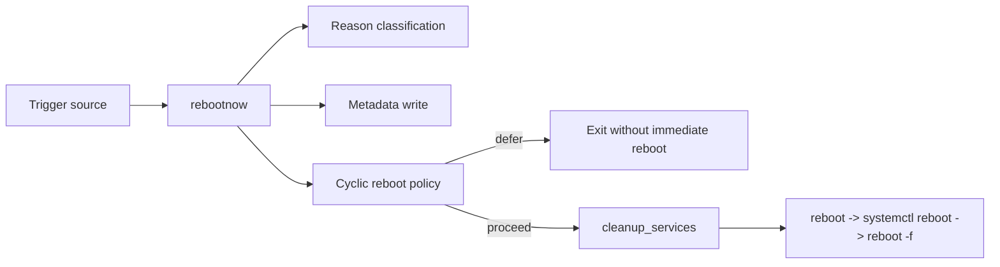

# reboot-manager

`reboot-manager` is the RDK component that controls how software-initiated reboots are handled on device.

At runtime, the `rebootnow` binary does more than just call reboot:

1. identifies **who triggered** the reboot and **why**,
2. classifies reboot reason into operational categories,
3. persists reboot metadata for post-reboot consumers,
4. detects potential reboot loops and can defer reboot safely,
5. performs housekeeping before reboot,
6. executes reboot with a fallback chain.

This README explains what the component does, how files are used, and how to build/test/debug it.

## Component Purpose and Problem Statement

In production devices, reboot requests can come from many software paths (application trigger, crash path,
maintenance window, firmware-related path). A plain reboot command does not provide enough context for:

- post-reboot analysis,
- loop prevention,
- telemetry and operations visibility,
- coordinated pre-reboot cleanup.

`reboot-manager` is the control point that standardizes these behaviors.

## Runtime Execution Flow

When `rebootnow` is invoked:

1. Initializes logger, telemetry hooks (if enabled), and RBUS.
2. Enforces **single instance** via PID guard.
3. Parses CLI input (`-s/-c/-r/-o`).
4. Classifies reason (`APP_TRIGGERED`, `OPS_TRIGGERED`, `MAINTENANCE_REBOOT`, `FIRMWARE_FAILURE`).
5. Writes reboot metadata to log + JSON files.
6. Applies cyclic reboot logic using RFC flags + previous reboot state.
7. If allowed, executes cleanup and reboot flow.
8. If reboot command fails, escalates fallback (`reboot` → `systemctl reboot` → `reboot -f`).

## Repository Structure

```text
reboot-manager/
├── rebootnow/
│   ├── include/
│   │   ├── rebootnow.h
│   │   └── rbus_interface.h
│   └── src/
│       ├── main.c                 # CLI parsing + orchestration
│       ├── cyclic_reboot.c        # loop detection/defer policy
│       ├── system_cleanup.c       # pre-reboot cleanup + PID guard
│       ├── rbus_interface.c       # RBUS wrappers
│       └── utils.c                # timestamp/log/T2 helpers
├── unittest/                      # L1 gtest suites
├── tests/functional_tests/        # L2 functional tests
├── docs/                          # HLD/LLD/testing/diagrams
├── unit_test.sh                   # unit + coverage runner
└── run_l2.sh                      # functional runner
```

## Architecture

### Core Modules

- `main.c`: command handling, reason classification, metadata persistence, reboot orchestration.
- `cyclic_reboot.c`: compares current vs previous reboot context and controls defer behavior.
- `system_cleanup.c`: signals key services, syncs/cleans resources, and owns PID guard implementation.
- `rbus_interface.c`: stable typed wrappers around `rbus_get/rbus_set`.
- `utils.c`: shared utility functions.

### High-Level Control Path



## Inputs and Outputs

### Inputs

#### CLI Inputs

- `-s <source>`: source process for standard reboot path.
- `-c <source>`: source process for crash-trigger path.
- `-r <custom_reason>`: optional custom category value.
- `-o <other_reason>`: optional free-text context.

#### RFC / RBUS Inputs

- `Device.DeviceInfo.X_RDKCENTRAL-COM_RFC.Feature.RebootStop.Detection`
- `Device.DeviceInfo.X_RDKCENTRAL-COM_RFC.Feature.RebootStop.Duration`
- `Device.DeviceInfo.X_RDKCENTRAL-COM_RFC.Feature.RebootStop.Enable`
- `Device.DeviceInfo.X_RDKCENTRAL-COM_RFC.Feature.ManageableNotification.Enable`

### Outputs (Files and Effects)

#### Log and State Files

- `/opt/logs/rebootreason.log`: operational logs.
- `/opt/logs/rebootInfo.log`: current reboot detail fields.
- `/opt/secure/reboot/reboot.info`: current reboot JSON payload.
- `/opt/secure/reboot/previousreboot.info`: persisted reboot JSON for next-cycle comparison.
- `/opt/secure/reboot/parodusreboot.info`: previous reboot line consumed by downstream integration.
- `/opt/secure/reboot/rebootNow`: marker that rebootnow initiated reboot path.
- `/opt/secure/reboot/rebootStop`: marker for loop protection mode.
- `/opt/secure/reboot/rebootCounter`: loop detection counter.

#### Runtime Side Effects

- T2 telemetry markers (when enabled).
- RBUS set for reboot stop and manageable notification behavior.
- Scheduled deferred reboot cron entry in cyclic loop conditions.

## Reboot Classification Logic

Source process names are matched against predefined lists:

- App-trigger list → `APP_TRIGGERED`
- Ops-trigger list → `OPS_TRIGGERED`
- Maintenance-trigger list → `MAINTENANCE_REBOOT`
- No match → `FIRMWARE_FAILURE`

If custom reason is `MAINTENANCE_REBOOT` for app-triggered source, maintenance classification is preserved.

## Cyclic Reboot Protection (Important)

The cyclic logic prevents repeated reboot storms for the same cause.

### Decision Inputs

1. Detection enable RFC.
2. Previous reboot context from `/opt/secure/reboot/previousreboot.info`.
3. Uptime window check (short-window repeated reboot behavior).
4. Same-cause match: source + reason + customReason + otherReason.
5. Reboot counter threshold.

### Behavior

- If same-cause reboot repeats inside window:
	- increments reboot counter,
	- once threshold is reached, enables stop mode,
	- sets stop RFC,
	- emits cyclic telemetry marker,
	- schedules deferred reboot after configured pause duration.

- If reason differs or window is exceeded:
	- resets counter,
	- clears stop mode,
	- removes any existing deferred reboot cron entry.

## Pre-Reboot Cleanup Behavior

`cleanup_services()` performs pre-reboot stabilization tasks such as:

- signaling `telemetry2_0` and `parodus`,
- selected service stops when applicable,
- log synchronization and temp/resource cleanup paths,
- final `sync()` before reboot transition.

## Build

### Prerequisites

Build requires autotools and standard C toolchain:
- `autoconf`, `automake`, `libtool`, `make`, `gcc`

Runtime/link dependencies are provided by RDK platform layers (for example: `rbus`,
`secure_wrapper`, `rdkloggers`, `fwutils`).

### Configure and Build

```bash
autoreconf -fi
./configure
make -j$(nproc)
```

### Optional Configure Flags

- Enable telemetry markers:

```bash
./configure --enable-t2api
```

- Enable breakpad integration:

```bash
./configure --enable-breakpad
```

- Enable CPC companion binary:

```bash
./configure --enable-cpc
```

## Usage

`rebootnow` options:

```text
-s <source>   source process triggering reboot (normal)
-c <source>   source process triggering reboot (crash)
-r <custom>   custom reason (example: MAINTENANCE_REBOOT)
-o <other>    additional reason context
-h            help
```

Examples:

```bash
rebootnow -s HtmlDiagnostics -o "User requested reboot"
rebootnow -c dsMgrMain -r MAINTENANCE_REBOOT -o "Crash detected"
```

## Operational Notes

- `rebootInfo.log` is reset per invocation before writing current reboot fields.
- `write_rebootinfo_log` is append-based, so the reset step in orchestration is required for latest-only content.
- PID guard path prevents two `rebootnow` instances from running concurrently.

## Testing

### L1 Unit Tests

Run all GTest binaries and generate coverage:

```bash
./unit_test.sh
```

Run without coverage instrumentation:

```bash
./unit_test.sh --disable-cov
```

### L2 Functional Tests

```bash
./run_l2.sh
```

This executes pytest-based tests in `tests/functional_tests/test` and writes JSON reports
under `/tmp/l2_test_report`.

## Troubleshooting

### `rebootnow` exits early without reboot

- Check cyclic reboot stop state files under `/opt/secure/reboot/`.
- Verify RFC detection/stop params via RBUS/TR-181.
- Inspect `rebootreason.log` and `rebootInfo.log`.

### Reboot reason appears inconsistent

- Check invocation arguments (`-s/-c/-r/-o`) and source naming.
- Validate `previousreboot.info` content if cyclic comparison is active.

### Reboot command fallback behavior observed

- This is expected when initial reboot command does not complete within wait path.
- Review logs for transition from `reboot` to `systemctl reboot` to `reboot -f`.

## Documentation

- [Documentation index](docs/README.md)
- [Component architecture](docs/architecture.md)
- [Build and test guide](docs/testing.md)
- [High-Level Design](docs/reboot-manager-hld.md)
- [Low-Level Design](docs/reboot-manager-lld.md)
- [Flowchart](docs/diagrams/flowchart.md)
- [Sequence diagram](docs/diagrams/sequence-diagram.md)

## Contributing

See [CONTRIBUTING.md](CONTRIBUTING.md).

## License

Licensed under Apache-2.0. See [LICENSE](LICENSE) and [NOTICE](NOTICE).

