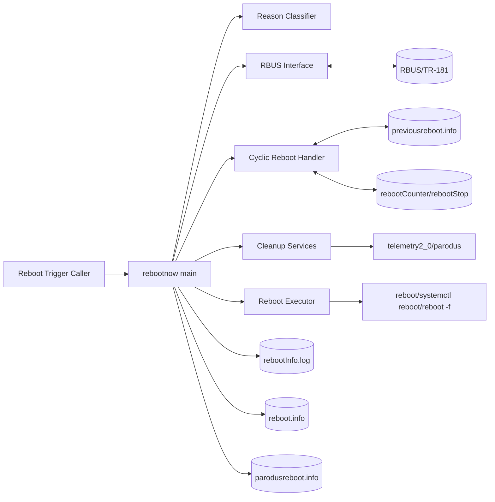
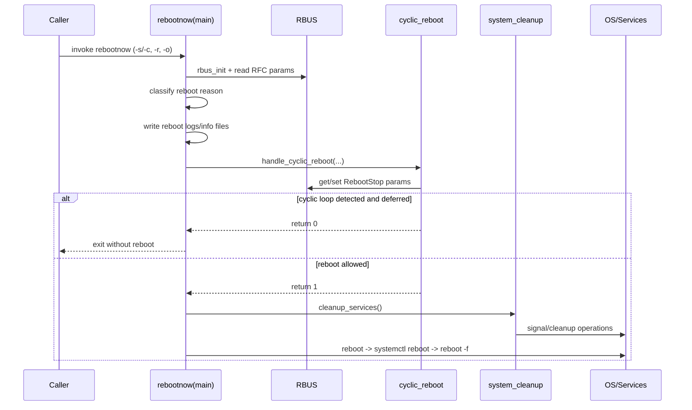

# High-Level Design: reboot-manager

## 1. Document Information

- Component: reboot-manager
- Binary: rebootnow
- Version: 1.0
- Date: 2026-02-27
- Scope: High-level architecture and behavior of reboot-manager C implementation

## 2. Executive Summary

reboot-manager orchestrates controlled device reboot operations in RDK environments.
It collects reboot trigger context, classifies reboot category, persists reboot metadata for post-reboot consumers,
applies cyclic reboot protection, performs pre-reboot cleanup, and executes reboot with fallback.

The implementation is modularized in C for maintainability, deterministic behavior, and integration with RBUS,
telemetry, and existing RDK workflows.

## 3. Goals and Non-Goals

### 3.1 Goals

1. Preserve functional behavior expected from rebootNow script-equivalent flow.
2. Persist reliable reboot context in plain log and structured files.
3. Prevent unsafe reboot loops through cyclic reboot controls.
4. Integrate with RBUS RFCs and telemetry markers.
5. Ensure robust reboot fallback behavior.

### 3.2 Non-Goals

1. Redesigning external TR-181/RBUS schema.
2. Implementing platform policy engines beyond current RFC-driven logic.
3. Replacing platform services such as parodus, telemetry2_0, or secure wrapper.

## 4. Functional Scope

### 4.1 Inputs

- Command line arguments:
  - `-s <source>` normal reboot trigger source
  - `-c <source>` crash-trigger source
  - `-r <custom reason>` optional custom reason
  - `-o <other reason>` optional additional detail

- RBUS/TR-181 parameters:
  - `Device.DeviceInfo.X_RDKCENTRAL-COM_RFC.Feature.RebootStop.Detection`
  - `Device.DeviceInfo.X_RDKCENTRAL-COM_RFC.Feature.RebootStop.Duration`
  - `Device.DeviceInfo.X_RDKCENTRAL-COM_RFC.Feature.RebootStop.Enable`
  - `Device.DeviceInfo.X_RDKCENTRAL-COM_RFC.Feature.ManageableNotification.Enable`

### 4.2 Outputs

- Logs and state files:
  - `/opt/logs/rebootreason.log`
  - `/opt/logs/rebootInfo.log`
  - `/opt/secure/reboot/reboot.info`
  - `/opt/secure/reboot/previousreboot.info`
  - `/opt/secure/reboot/parodusreboot.info`
  - `/opt/secure/reboot/rebootNow`
  - `/opt/secure/reboot/rebootStop`
  - `/opt/secure/reboot/rebootCounter`

- Side effects:
  - T2 telemetry markers
  - RBUS set for reboot stop and notification signaling
  - reboot command execution with fallback path

## 5. High-Level Architecture

### 5.1 Module Decomposition

1. `main.c`
   - CLI parsing
   - reboot reason categorization
   - reboot metadata persistence orchestration
   - cyclic reboot decision hook
   - cleanup and reboot execution sequence

2. `cyclic_reboot.c`
   - reads previous reboot metadata
   - compares current vs previous reboot context
   - maintains reboot loop counter and stop-window policy
   - schedules deferred cyclic reboot when threshold is hit

3. `system_cleanup.c`
   - signals services before reboot
   - log synchronization and cleanup operations
   - PID-file single-instance guard functions

4. `rbus_interface.c`
   - RBUS session lifecycle management
   - typed getters and setters for TR-181 parameters

5. `utils.c`
   - timestamp generation
   - generic file write helper for reboot logs
   - T2 wrappers

### 5.2 Component Diagram

## 6. End-to-End Flow

1. Initialize logger, telemetry (optional), and RBUS.
2. Enforce single-instance guard via PID file.
3. Parse and validate command-line arguments.
4. Categorize reboot reason class.
5. Persist reboot context to logs and JSON info files.
6. Invoke cyclic reboot policy decision.
7. If allowed, execute cleanup sequence.
8. Trigger reboot with progressive fallback strategy.

## 7. Reliability and Safety

1. Validation for required/compatible arguments.
2. RBUS failures handled with safe defaults where applicable.
3. File I/O errors are logged with errno context.
4. Reboot fallback chain reduces reboot failure risk.
5. Signal and exit handlers enforce PID-file cleanup.

## 8. Build and Test View

- Build system: autotools (`configure.ac`, `Makefile.am`)
- Deliverables: `librebootnow.la`, `rebootnow`, optional `update-prev-reboot-info`
- Test strategy:
  - L1 unit tests (GTest)
  - L2 functional tests (pytest + feature files)
  - Coverage via lcov in unit test workflow
