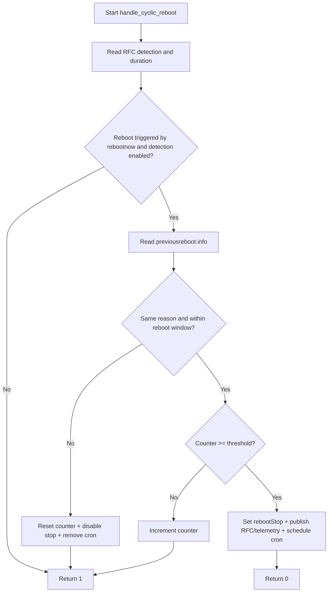

# Low-Level Design: reboot-manager

## 1. Document Information

- Component: reboot-manager
- Binary: rebootnow
- Version: 1.0
- Date: 2026-02-27
- Scope: module-level and function-level behavior of reboot-manager implementation

## 2. Source Layout

```text
rebootnow/
├── include/
│   ├── rebootnow.h
│   └── rbus_interface.h
└── src/
    ├── main.c
    ├── cyclic_reboot.c
    ├── system_cleanup.c
    ├── rbus_interface.c
    └── utils.c
```

## 3. Public Interfaces

### 3.1 rebootnow.h

- `int handle_cyclic_reboot(const char *source, const char *rebootReason, const char *customReason, const char *otherReason);`
- `void timestamp_update(char *buf, size_t sz);`
- `int write_rebootinfo_log(const char *path, const char *line);`
- `void cleanup_services(void);`
- `int pidfile_write_and_guard(void);`
- `void cleanup_pidfile(void);`
- `void t2CountNotify(const char *marker, int val);`
- `void t2ValNotify(const char *marker, const char *val);`

### 3.2 rbus_interface.h

- `bool rbus_init(void);`
- `void rbus_cleanup(void);`
- `bool rbus_get_string_param(const char* param_name, char* value_buf, size_t buf_size);`
- `bool rbus_get_bool_param(const char* param_name, bool* value);`
- `bool rbus_get_int_param(const char* param_name, int* value);`
- `bool rbus_set_bool_param(const char* param_name, bool value);`
- `bool rbus_set_int_param(const char* param_name, int value);`

## 4. main.c Design

### 4.1 Responsibilities

1. Parse CLI arguments (`-s`, `-c`, `-r`, `-o`, `-h`).
2. Initialize logging, optional telemetry, RBUS session, and PID guard.
3. Classify reboot reason from source list tables.
4. Persist current reboot details into text and JSON files.
5. Call cyclic reboot handler to decide defer vs immediate reboot.
6. Trigger pre-reboot cleanup and reboot sequence with fallback.

### 4.2 Core Helpers

- `usage(FILE *out)`: prints command usage.
- `check_string_value(...)`: substring match against trigger source arrays.
- `emit_t2_for_source(...)`: emits mapped T2 marker based on source and crash flag.
- `signal_cleanup_handler(...)`: signal handler to cleanup PID file.
- `update_reboot_log(...)`: safe append into fixed-size message buffer using `vsnprintf`.

### 4.3 Reboot Metadata Write Path

1. Truncates `/opt/logs/rebootInfo.log` with `fopen(..., "w")`.
2. Writes key lines to rebootInfo log:
   - `RebootReason`
   - `RebootInitiatedBy`
   - `RebootTime`
   - `CustomReason`
   - `OtherReason`
3. Writes JSON to:
   - `/opt/secure/reboot/reboot.info`
   - `/opt/secure/reboot/previousreboot.info`
4. Appends `PreviousRebootInfo:<...>` to `/opt/secure/reboot/parodusreboot.info`.

### 4.4 Reboot Execution Path

1. Creates reboot trigger flag file `/opt/secure/reboot/rebootNow`.
2. Calls `cleanup_services()`.
3. Attempts `reboot` via `fork + execlp`.
4. Waits 90s; if still running, attempts `systemctl reboot`.
5. Terminates child and issues force fallback `reboot -f`.

## 5. cyclic_reboot.c Design

### 5.1 Responsibilities

1. Read RFC controls for reboot-stop detection and pause duration.
2. Compare current reboot context with previous reboot info.
3. Detect repeated reboot loops within reboot window.
4. Maintain and persist reboot counter.
5. Enter reboot-stop mode and schedule deferred reboot if threshold is reached.

### 5.2 Internal Helpers

- `file_exists(path)`
- `read_rebootcounter(path, out)` / `write_rebootcounter(path, value)`
- `touch_file(path)`
- `read_proc_uptime_secs()`
- `extract_json_value(buf, key, out, outsz)`
- `read_previous_reboot_info(...)`
- `compute_cron_time(add_minutes, out, outsz)`

### 5.3 Decision Logic

1. Read `RebootStop.Detection` and `RebootStop.Duration`.
2. If last reboot was by rebootnow and detection enabled:
   - Read previous reboot metadata file.
   - Compare current and previous context fields.
   - If same reason within window:
     - Increment counter, or
     - If threshold reached, set stop flag and schedule cron-based deferred reboot.
3. If reason differs or outside window:
   - Reset reboot counter.
   - Disable stop flag RFC and remove reboot-stop file/cron.
4. Return `0` to defer reboot, `1` to proceed immediately.

### 5.4 Cyclic Reboot Flow



## 6. system_cleanup.c Design

### 6.1 Responsibilities

1. Pre-reboot signaling and service stop operations.
2. Log synchronization and directory cleanup operations.
3. Single-instance process guard and PID lifecycle.

### 6.2 Key Operations in cleanup_services

1. Signal `telemetry2_0` with `SIGIO` to flush pending messages before reboot; signal `parodus` with `SIGUSR1` for graceful shutdown.
2. Optional cleanups for RDM, temp logs, and transient directories.
3. Conditional bluetooth stack/service stop if enabled.
4. Call `sync()` and short delay before reboot.

### 6.3 PID Guard Design

- `pidfile_write_and_guard()` uses atomic create (`O_CREAT|O_EXCL`) on `/tmp/.rebootNow.pid`.
- If PID file exists:
  1. acquire advisory write lock via `fcntl`
  2. inspect existing pid cmdline under `/proc/<pid>/cmdline`
  3. if running rebootnow instance exists, return failure
  4. otherwise overwrite PID file with current PID under lock
- `cleanup_pidfile()` removes PID file on normal and signal exits.

## 7. rbus_interface.c Design

### 7.1 Responsibilities

1. Maintain singleton RBUS handle state.
2. Provide typed get/set wrappers with parameter validation and logging.

### 7.2 State Model

- `g_rbusHandle` stores active RBUS handle.
- `g_rbusInitialized` tracks initialization state.
- All getters/setters require initialized RBUS state.

### 7.3 API Behavior

1. `rbus_init` opens RBUS handle once (`RebootInfoLogs`).
2. `rbus_cleanup` closes handle safely.
3. `rbus_get_*` reads value via `rbus_get`, converts and logs.
4. `rbus_set_*` creates temporary `rbusValue_t`, sets and commits via `rbus_set`.

## 8. utils.c Design

### 8.1 Functions

- `timestamp_update`: writes UTC timestamp in `%a %b %d %H:%M:%S UTC %Y` format.
- `write_rebootinfo_log`: appends one line to the target log file.
- `t2CountNotify` / `t2ValNotify`: compile-time gated telemetry wrappers.

## 9. Error Handling Patterns

1. File open/read/write failures return error or log and continue depending on criticality.
2. RBUS failures return false and are logged with function context.
3. Reboot path uses fallback sequence for resilience.
4. Buffer writes are bounded using fixed-size arrays and `snprintf`/`vsnprintf`.

## 10. Build and Test Notes

### 10.1 Build

Autotools-based build from repository root:

```bash
autoreconf -fi
./configure
make -j$(nproc)
```

### 10.2 Unit Tests

`unit_test.sh` builds and executes:

- `reboot_utils_gtest`
- `reboot_rbus_gtest`
- `reboot_cyclic_gtest`
- `reboot_system_gtest`
- `reboot_main_gtest`

Coverage is generated via lcov by default.

### 10.3 Functional Tests

`run_l2.sh` executes pytest suites under `tests/functional_tests/test` and stores JSON reports in `/tmp/l2_test_report`.
