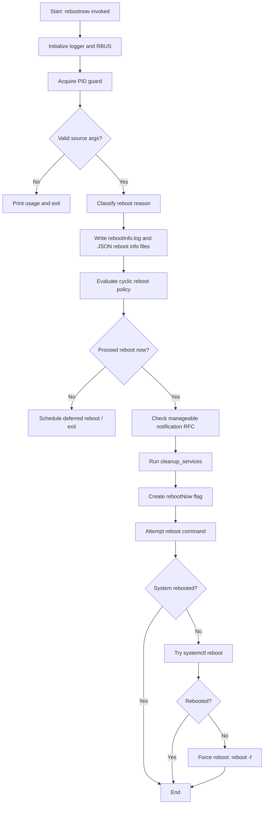

```mermaid
flowchart TD
    A[Start: rebootnow invoked] --> B[Initialize logger and RBUS]
    B --> C[Acquire PID guard]
    C --> D{Valid source args?}
    D -- No --> E[Print usage and exit]
    D -- Yes --> F[Classify reboot reason]

    F --> G[Write rebootInfo.log and JSON reboot info files]
    G --> H[Evaluate cyclic reboot policy]

    H --> I{Proceed reboot now?}
    I -- No --> J[Schedule deferred reboot / exit]
    I -- Yes --> K[Check manageable notification RFC]

    K --> L[Run cleanup_services]
    L --> M[Create rebootNow flag]
    M --> N[Attempt reboot command]
    N --> O{System rebooted?}
    O -- Yes --> P[End]
    O -- No --> Q[Try systemctl reboot]
    Q --> R{Rebooted?}
    R -- Yes --> P
    R -- No --> S[Force reboot: reboot -f]
    S --> P
```
