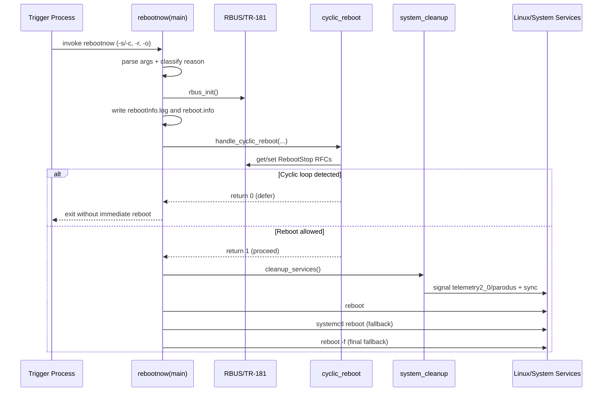

```mermaid
sequenceDiagram
    participant Caller as Trigger Process
    participant Main as rebootnow(main)
    participant RBUS as RBUS/TR-181
    participant Cyclic as cyclic_reboot
    participant Cleanup as system_cleanup
    participant OS as Linux/System Services

    Caller->>Main: invoke rebootnow (-s/-c, -r, -o)
    Main->>Main: parse args + classify reason
    Main->>RBUS: rbus_init()
    Main->>Main: write rebootInfo.log and reboot.info

    Main->>Cyclic: handle_cyclic_reboot(...)
    Cyclic->>RBUS: get/set RebootStop RFCs

    alt Cyclic loop detected
        Cyclic-->>Main: return 0 (defer)
        Main-->>Caller: exit without immediate reboot
    else Reboot allowed
        Cyclic-->>Main: return 1 (proceed)
        Main->>Cleanup: cleanup_services()
        Cleanup->>OS: signal telemetry2_0/parodus + sync
        Main->>OS: reboot
        Main->>OS: systemctl reboot (fallback)
        Main->>OS: reboot -f (final fallback)
    end
```
