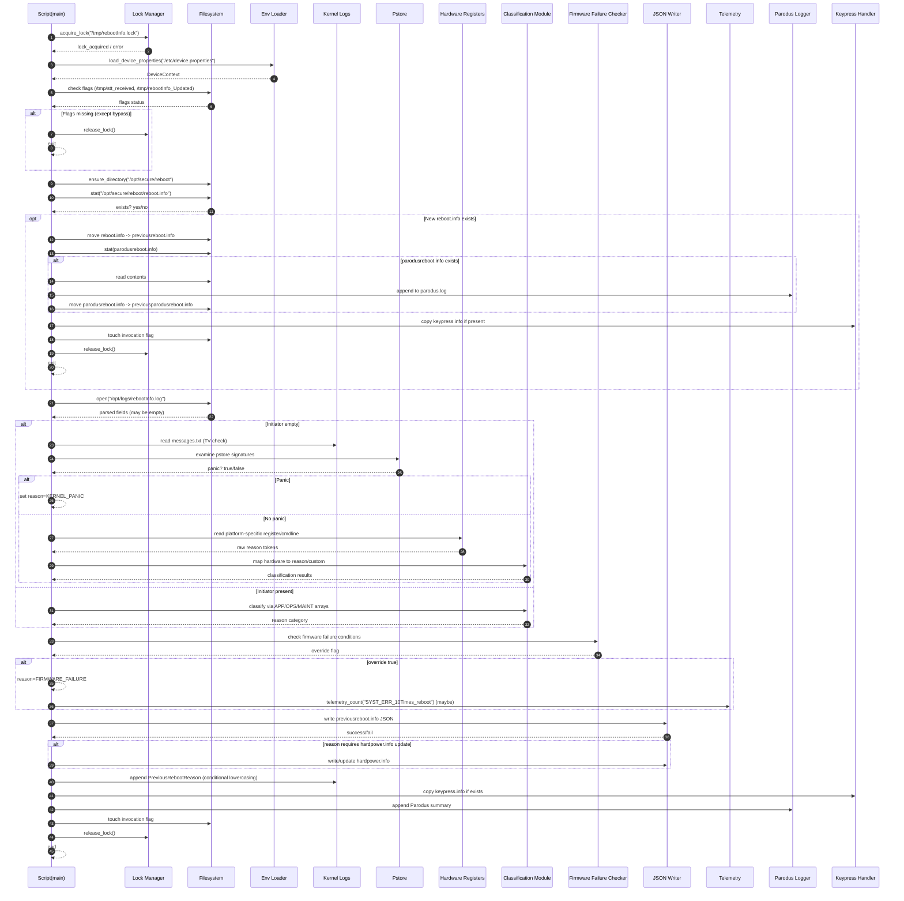

# Sequence Diagrams: Reboot Reason Updater

## 1. Mermaid Sequence Diagram



## 2. Simplified Text-Based Sequence

```
Script -> LockManager: acquire
LockManager -> Script: success

Script -> Env: load device properties
Env -> Script: DeviceContext

Script -> FS: verify gating flags
FS -> Script: status
[If missing and not bypass] -> release lock, exit

Script -> FS: ensure reboot directory
Script -> FS: check presence of reboot.info
[If present]:
    move file -> previousreboot.info
    handle parodusreboot.info if exists
    keypress copy
    create invocation flag
    release lock
    exit

Else:
    Script -> FS: parse rebootInfo.log
    If initiator empty:
        Script -> KernelLogs/Pstore: panic scan
        If panic -> set panic reason
        Else -> Script -> HW: read register/cmdline/reset code
                HW -> Script: tokens
                Script -> Classification: hardware mapping
    Else:
        Script -> Classification: membership mapping

    Script -> FirmwareFailureChecker: analyze logs
    If override -> reason = FIRMWARE_FAILURE

    Script -> JSONWriter: persist previousreboot.info
    If hardpower required -> JSONWriter: update hardpower.info
    Script -> KernelLogs: append previous reason (platform conditional)
    Script -> Keypress: copy keypress file
    Script -> ParodusLogger: append summary
    Script -> FS: touch invocation flag
    Script -> LockManager: release
END
```

## 3. Notes
- Telemetry events are conditional; design must allow them to be no-ops when library absent.
- Hardware interaction isolated to platform modules for maintainability.
- Sequence ensures early exit conditions release lock to prevent deadlock.

*End of Sequence Diagrams.*
